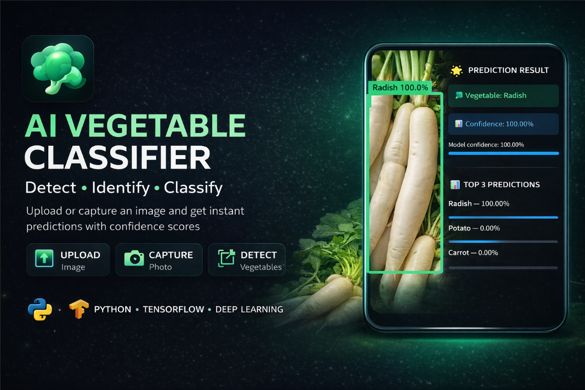

# 🥦 AI Vegetable Classifier  

<p align="center">
  
</p>

<p align="center">
  
  
  
  
  
</p>

<p align="center">
  🚀 Detect • Identify • Classify Vegetables using AI  
</p>

---

## 🚀 Project Overview

An end-to-end **Deep Learning project** that detects, identifies, and classifies vegetables from images using **CNN and Transfer Learning (MobileNetV2)**.  

The best-performing model is deployed as an **interactive Streamlit web application** with real-time prediction and bounding box detection.

---

## 📊 Results

| Model | Accuracy | Loss | Notes |
|------|---------|------|------|
| Custom CNN | 99.27% | 0.0226 | Lightweight |
| MobileNetV2 (Transfer Learning) | 99.70% | 0.0079 | Best Model |

---

## 🧠 Models Used

### 🔹 Custom CNN
- Conv2D + BatchNorm + MaxPooling
- Dropout for regularization
- Optimizer: Adam

### 🔹 Transfer Learning (MobileNetV2)
- Pretrained on ImageNet
- Fine-tuned last layers
- Faster training and higher accuracy

---

## 📁 Project Structure

```

Vegetable-Classification/
│
├── image/
│   └── thumbnail.png
│
├── notebook/
│   └── CNN_Project.ipynb
│
├── Vegetable Images/
│   ├── train/
│   ├── validation/
│   └── test/
│
├── app.py
├── best_transfer_model.keras
├── veg_info.py
├── recipe_info.py
├── requirements.txt
├── README.md

````

---

## 🥦 Dataset

- Source: Kaggle Vegetable Dataset  
- Classes: 15  
- Total Images: 21,000+  
- Image Size: 128 × 128  

### Classes:
Bean, Bitter Gourd, Bottle Gourd, Brinjal, Broccoli,  
Cabbage, Capsicum, Carrot, Cauliflower, Cucumber,  
Papaya, Potato, Pumpkin, Radish, Tomato  

---

## ⚙️ Installation

### 1️⃣ Clone Repository
```bash
git clone https://github.com/your-username/vegetable-classifier.git
cd vegetable-classifier
````

### 2️⃣ Create Virtual Environment

```bash
python -m venv cnnenv

# Windows
cnnenv\Scripts\activate

# macOS/Linux
source cnnenv/bin/activate
```

### 3️⃣ Install Dependencies

```bash
pip install -r requirements.txt
```

---

## ▶️ Run the Application

```bash
streamlit run app.py
```

Open in browser:
👉 [http://localhost:8501](http://localhost:8501)

---

## 💡 Features

* 📸 Upload or capture image
* 🎯 Bounding box detection
* 📊 Top 3 predictions with confidence
* 🥗 Nutritional information
* 🍲 Recipe suggestions
* ❌ Non-vegetable detection

---

## 🔍 Detection Pipeline

```
Input Image
   ↓
GrabCut Segmentation
   ↓
Morphological Processing
   ↓
Contour Detection
   ↓
Bounding Box
   ↓
Crop Image
   ↓
Model Prediction
```

---

## ⚡ Performance Optimization

* tf.data pipeline optimization
* cache() and prefetch()
* GPU training (Google Colab T4)
* Transfer learning for faster convergence

---

## 🛠️ Tech Stack

* Python
* TensorFlow / Keras
* OpenCV
* Streamlit
* NumPy, Pandas
* Matplotlib, Seaborn

---

## 📸 Project Preview

<p align="center">
  
</p>

---

## 📈 Key Learnings

* CNN architecture design
* Transfer Learning (MobileNetV2)
* Image preprocessing
* Model evaluation techniques
* End-to-end ML deployment

---

## 🌍 Applications

* Smart agriculture 🌱
* Food quality detection 🍅
* Retail automation 🛒
* AI sorting systems

---

## 📌 Future Improvements

* Add more classes
* Use YOLO for detection
* Deploy on cloud (AWS / GCP)
* Mobile app integration

---

## 📄 License

This project is for educational purposes.

---

## 🙌 Author

**Nikhil Borade**
Data Science Enthusiast

---

⭐ If you like this project, don’t forget to star the repo!

---
